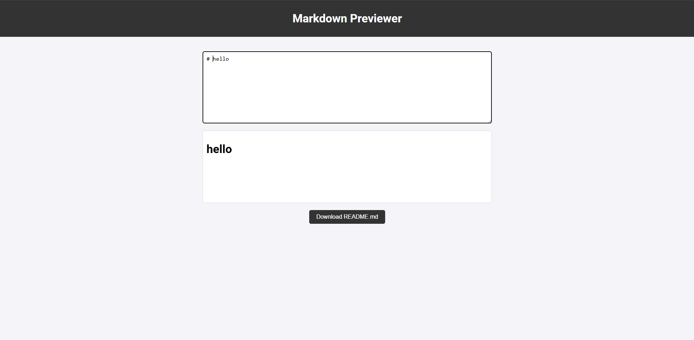

# Markdown Previewer

## Overview
This is a simple Markdown Previewer built using HTML, JavaScript, and the Marked.js library. Users can enter Markdown text in a textarea, and the rendered HTML is displayed in real-time. Additionally, users can download their Markdown content as a `README.md` file.

## Features
- Live preview of Markdown input using Marked.js.
- Download Markdown content as a `README.md` file.
- Responsive and user-friendly interface.

## Technologies Used
- HTML
- CSS
- JavaScript
- Marked.js (for Markdown parsing)

## Screenshots

## Usage
1. Enter Markdown text in the textarea.
2. See the live preview update as you type.
3. Click the "Download README.md" button to save your content as a Markdown file.

## Deployment
The application is hosted online. You can access it here:
[Live Demo](https://9397karan.github.io/Markdown_Previewer/)
